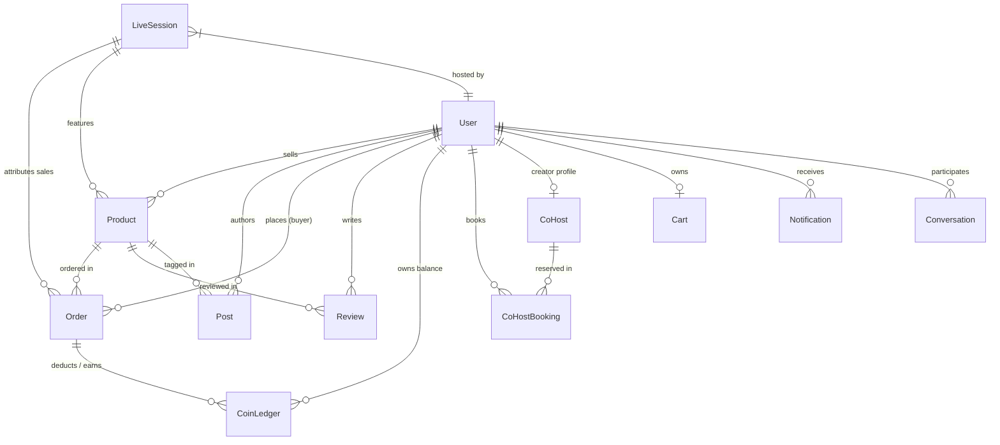
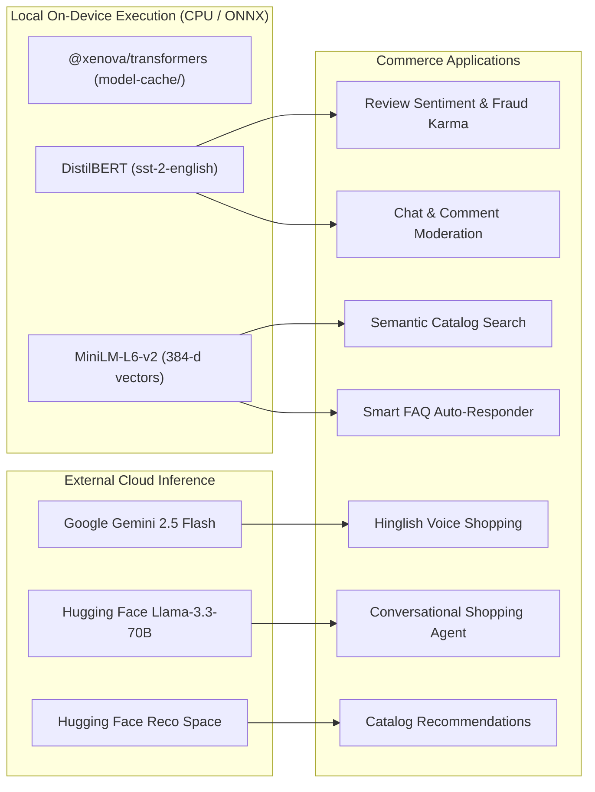

# Lokaly Backend

> High-performance social-commerce backend engine powering live video commerce, social shopping feeds, conversational AI, hyperlocal discovery, and gamified loyalty for Indian artisans and buyers.

[](https://nodejs.org/)
[](https://expressjs.com/)
[](https://mongoosejs.com/)
[](https://socket.io/)
[](https://huggingface.co/docs/transformers.js)
[](https://aistudio.google.com/)
[](LICENSE)

---

## Table of Contents

- [Executive Overview](#executive-overview)
- [System Architecture](#system-architecture)
- [Technology Stack](#technology-stack)
- [Repository Structure](#repository-structure)
- [Environment Configuration](#environment-configuration)
- [Database & Domain Architecture](#database--domain-architecture)
- [Authentication & Security Pipeline](#authentication--security-pipeline)
- [Real-Time & Socket.IO Architecture](#real-time--socketio-architecture)
- [Live Video Commerce & Agora RTC](#live-video-commerce--agora-rtc)
- [AI & Machine Learning Subsystems](#ai--machine-learning-subsystems)
  - [Local In-Process ONNX Pipelines](#local-in-process-onnx-pipelines)
  - [Conversational Shopping AI Assistant](#conversational-shopping-ai-assistant)
  - [Voice Shopping & Multilingual NLU](#voice-shopping--multilingual-nlu)
  - [Recommendation & Semantic Search](#recommendation--semantic-search)
- [Hyperlocal & Geospatial Engine](#hyperlocal--geospatial-engine)
- [Order Lifecycle & Payment Processing](#order-lifecycle--payment-processing)
- [Gamification, Trust & Creator Systems](#gamification-trust--creator-systems)
  - [Seller Trust Graph (6-Signal Model)](#seller-trust-graph-6-signal-model)
  - [Behavioral Fraud Karma](#behavioral-fraud-karma)
  - [Seller Stress Radar](#seller-stress-radar)
  - [Community Coins Ledger](#community-coins-ledger)
  - [Creator Co-Host Talent Marketplace](#creator-co-host-talent-marketplace)
  - [Referral & Equity Cashback](#referral--equity-cashback)
- [REST API Reference](#rest-api-reference)
- [Frontend Integration & Contract Audit](#frontend-integration--contract-audit)
- [Local Setup & Bootstrap](#local-setup--bootstrap)
- [Verification & Quality Assurance](#verification--quality-assurance)
- [Production Deployment](#production-deployment)
- [Performance & Security Posture](#performance--security-posture)
- [Implementation Status & Limitations](#implementation-status--limitations)
- [Roadmap](#roadmap)
- [Related Repositories & License](#related-repositories--license)

---

## Executive Overview

**Lokaly** is an omnichannel social commerce platform engineered to bridge local Indian craftspeople, weavers, and regional merchants directly with buyers. The platform synthesizes Instagram-style visual content, interactive live video drops, and real-time hyperlocal proximity search into a unified commerce experience.

### What the Backend Does

1. **Social Discovery & Media**: Ingests, serves, and aggregates creator posts, product-tagged reels, nested comments, and trending hashtag velocity metrics.
2. **Interactive Live Commerce**: Orchestrates low-latency live streaming sessions powered by Agora RTC token generation, synchronized multi-viewer chat, real-time product pinning, flash deal claims, interactive polling, wheel spins, and threshold-based group buying.
3. **Hybrid AI & ML Architecture**:
   - **Edge/Local CPU Inference**: Zero-API-key local ONNX pipelines via `@xenova/transformers` for review sentiment scoring, text moderation, and 384-dimensional sentence embeddings for semantic catalog search.
   - **Conversational Shopping**: Multi-turn shopping assistant running Hugging Face `Llama-3.3-70B-Instruct` with contextual product injection and tappable follow-up prompt chips.
   - **Voice NLU**: Multilingual voice query parsing leveraging Google Translate and `gemini-2.5-flash` with deterministic regex fallbacks for Hinglish e-commerce intent extraction.
   - **Recommendation Fallback Cascade**: High-availability search cascading through Hugging Face inference models, Gemini query enrichment, Hindi/Hinglish synonym expansion, and diverse aggregation fallbacks.
4. **Hyperlocal Geospatial Routing**: Native MongoDB `2dsphere` geospatial indexing and `$geoNear` aggregation matching buyers to nearby inventory within dynamic seller delivery radii.
5. **Commerce & Financial Integrity**: Multi-item cart management, atomic inventory decrement with conflict rollbacks, 8-state order timeline tracking, Razorpay payment verification with HMAC-SHA256 authentication, and dev-mode sandboxing.
6. **Platform Trust & Gamification**: Mathematical trust scoring (0–100), behavioral fraud karma modeling, seller stress diagnostics, append-only coin ledgers with 180-day expiry sweeps, and an end-to-end live co-host booking talent marketplace.

---

## System Architecture

The following diagram illustrates the complete request lifecycle, subsystem boundaries, data stores, background daemons, and external services:

```mermaid
flowchart TD
    subgraph Clients["Client Layer"]
        FE["Lokaly Frontend (React / Vite)"]
        BrowserVoice["Web Speech API (STT / TTS)"]
        AgoraSDK["Agora RTC Web Client"]
    end

    subgraph Entry["Gateway & Middleware Pipeline"]
        HTTP["HTTP / Express Server (Port 5000 / 5050)"]
        WSS["Socket.IO Server (Engine.IO 4.7)"]
        SecMw["Helmet + CORS + Rate Limit (600 req/15m)"]
        AuthMw["requireAuth (Bearer JWT) + requireRole"]
    end

    subgraph Controllers["Modular Routing & Controllers"]
        AuthC["Auth & OTP Controller"]
        ProdC["Product & Search Controller"]
        PostC["Posts & Social Feed Controller"]
        CartC["Cart & Order Controller"]
        PayC["Payment Controller (Razorpay)"]
        LiveC["Live Commerce & Agora Controller"]
        ChatC["Chat & AI Assistant Controller"]
        CoHostC["Co-Host Marketplace Controller"]
        HyperC["Hyperlocal Geo Controller"]
        TrustC["Trust, Karma & Stress Controller"]
        CoinC["Coins & Referral Controller"]
    end

    subgraph Services["Core Domain Services"]
        SearchSvc["searchService (MiniLM Cosine)"]
        VoiceSvc["voiceIntent (Gemini 2.5 + Translate)"]
        ChatSvc["chatService (Llama 3.3 70B)"]
        ModSvc["moderationService (DistilBERT + Keywords)"]
        GeoUtil["geo.js (Haversine + GeoJSON)"]
        TrustSvc["trustService (6-Signal Formula)"]
        KarmaSvc["karmaService (Buyer/Seller Karma)"]
        StressSvc["stressService (Radar Diagnostics)"]
        CoinsSvc["coinsService (Append-only Ledger)"]
        NotifSvc["notificationService (Push & Socket)"]
    end

    subgraph Sockets["Real-Time Socket Sinks"]
        LiveHandlers["liveHandlers (Rooms: live:roomId)"]
        ChatHandlers["chatHandlers (Rooms: convo:convoId)"]
        UserRooms["User Direct Push (Rooms: user:userId)"]
    end

    subgraph DataML["Data Layer & Machine Learning"]
        MongoDB[("MongoDB Atlas (Mongoose 8)")]
        LocalONNX["@xenova/transformers (Local ONNX Cache)"]
    end

    subgraph External["External Cloud Services"]
        HFRouter["Hugging Face Router (Llama-3.3-70B)"]
        HFSpace["Hugging Face Space (Reco API)"]
        GeminiAPI["Google Gemini API (gemini-2.5-flash)"]
        GoogleTr["Google Translate Engine"]
        CloudinaryCDN["Cloudinary Media CDN"]
        RazorpayGW["Razorpay Payment Gateway"]
        AgoraCloud["Agora RTC Streaming Network"]
        SMTPServer["SMTP / Nodemailer Relay"]
    end

    subgraph Background["Daemons & Timers"]
        CoinSweep["Coin Expiry Sweep Daemon (24h)"]
    end

    %% Client communication
    FE -->|REST API HTTP Requests| HTTP
    FE -->|WebSocket Handshake JWT| WSS
    FE -.-> AgoraSDK
    FE -.-> BrowserVoice

    %% Pipeline flow
    HTTP --> SecMw --> AuthMw --> Controllers
    WSS --> Sockets

    %% Controller to service
    ProdC --> SearchSvc
    ChatC --> ChatSvc
    ChatC --> ModSvc
    LiveC --> LiveHandlers
    CartC --> OrderC[Order Processor]
    PayC --> OrderC
    CoHostC --> GeoUtil
    HyperC --> GeoUtil
    TrustC --> TrustSvc
    TrustC --> KarmaSvc
    TrustC --> StressSvc
    CoinC --> CoinsSvc

    %% Service to storage / models
    SearchSvc --> LocalONNX
    SearchSvc --> MongoDB
    ModSvc --> LocalONNX
    OrderC --> MongoDB
    CoinsSvc --> MongoDB
    TrustSvc --> MongoDB
    KarmaSvc --> MongoDB
    StressSvc --> MongoDB
    NotifSvc --> UserRooms
    NotifSvc --> MongoDB

    %% External calls
    VoiceSvc --> GeminiAPI
    VoiceSvc --> GoogleTr
    ChatSvc --> HFRouter
    ProdC --> HFSpace
    PayC --> RazorpayGW
    LiveC --> AgoraCloud
    AuthC --> SMTPServer
    ProdC --> CloudinaryCDN
    PostC --> CloudinaryCDN

    %% Sockets to DB
    LiveHandlers --> MongoDB
    ChatHandlers --> MongoDB
    ChatHandlers --> ModSvc
    LiveHandlers --> UserRooms
    ChatHandlers --> UserRooms

    %% Background
    CoinSweep --> CoinsSvc
```



---

## Technology Stack

| Layer | Component | Version | Role in Architecture |
|---|---|---|---|
| **Runtime** | Node.js | `>= 18.0.0` | Server-side JavaScript runtime engine |
| **Framework** | Express.js | `^4.19.2` | HTTP REST router, middleware orchestrator |
| **Database** | MongoDB | `>= 6.0.0` | Primary document database with native `2dsphere` spatial indexing |
| **ODM** | Mongoose | `^8.6.1` | Schema validation, pre/post hooks, relationship population |
| **Realtime** | Socket.IO | `^4.7.5` | Bi-directional event server, room management, connection recovery |
| **Local ML** | `@xenova/transformers` | `^2.17.2` | In-process ONNX execution: DistilBERT (sentiment) & MiniLM-L6-v2 (embeddings) |
| **Generative AI** | `@google/genai` | `^2.1.0` | SDK for Google Gemini 2.5 Flash query enrichment & voice NLU |
| **Translation** | `@vitalets/google-translate-api`| `^9.2.1` | Regional Indian language translation prior to intent parsing |
| **Live RTC** | `agora-access-token` | `^2.0.4` | Ephemeral cryptographic token generator for Agora live video channels |
| **Payments** | `razorpay` | `^2.9.4` | Payment order creation and HMAC-SHA256 signature verification |
| **Media Storage**| `cloudinary` + `multer` | `^2.4.0` / `^1.4.5` | Multipart memory buffering, streaming uploads, image/video optimization |
| **Security** | `helmet` + `cors` | `^7.1.0` / `^2.8.5` | Cross-origin resource policies, HTTP headers, CORS whitelisting |
| **Rate Limiter**| `express-rate-limit` | `^7.4.0` | Tiered API flood defense (600 requests per 15-minute sliding window) |
| **Auth** | `jsonwebtoken` + `bcryptjs`| `^9.0.2` / `^2.4.3` | HMAC-SHA256 stateless Bearer token issuance and salt-hashed passwords |
| **Email** | `nodemailer` | `^8.0.7` | SMTP transport for account verification links and 6-digit OTP codes |
| **Logging** | `morgan` | `^1.10.0` | HTTP request instrumentation in development environments |

---

## Repository Structure

```text
Lokaly-Backend/
├── docs/                               # Architecture and historical reference documentation
│   ├── API.md                          # Endpoint guide (historical snapshot)
│   └── ARCHITECTURE.md                 # Architecture design decisions
├── scripts/                            # Operational, backfill, and diagnostic CLI scripts
│   ├── backfillEmailVerified.js        # Data migration to populate isEmailVerified flags
│   ├── backfillSellerLocation.js       # Syncs user locations down to product.sellerLocation
│   ├── check-coins.js                  # Diagnostic tool for inspecting coin ledger balances
│   ├── seedDiverseProducts.js          # Extended seeding tool across diverse craft categories
│   └── verifyStressRadar.js            # Stress radar algorithm automated integration verification
├── src/                                # Main application source root
│   ├── app.js                          # Express application bootstrap & route mounting
│   ├── seed.js                         # Comprehensive Indian commerce demo data seed script
│   ├── seedGlasses.js                  # Specialized eyewear catalog seed
│   ├── server.js                       # HTTP server entrypoint, Socket.IO binding & cron runners
│   ├── config/                         # Environment and external client initializers
│   │   ├── cloudinary.js               # Cloudinary SDK credentials and status check
│   │   ├── db.js                       # Mongoose connection manager with retry logic
│   │   ├── env.js                      # Environment parser, type coercer & production validator
│   │   └── razorpay.js                 # Razorpay client initializer
│   ├── controllers/                    # Request handlers and business action coordinators
│   │   ├── agoraController.js          # Channel token generation wrapper
│   │   ├── authController.js           # Signup, login, profile, and legacy link verification
│   │   ├── cartController.js           # Cart mutation and subtotal computation
│   │   ├── chatController.js           # Direct messaging conversations and message log
│   │   ├── coHostController.js         # Co-host profile creation, slot booking, and updates
│   │   ├── coinsController.js          # Coin balance queries, redemption, and expiry triggers
│   │   ├── emailOtpController.js       # Cryptographic 6-digit OTP issue and constant-time verify
│   │   ├── faqController.js            # Smart FAQ retrieval and seller chat moderation logs
│   │   ├── hyperlocalController.js     # Geospatial $geoNear seller/product discovery & views
│   │   ├── leaderboardController.js    # Seller and buyer competitive ranking queries
│   │   ├── liveController.js           # Live session lifecycle, polls, flash deals, and spins
│   │   ├── mlController.js             # Diagnostic sentiment, embedding, and reindexing endpoints
│   │   ├── notificationController.js   # Notification queries, read receipts, and clearances
│   │   ├── orderController.js          # Cart-to-order pipeline, inventory locks, and status
│   │   ├── paymentController.js        # Razorpay order generation and HMAC verification
│   │   ├── postController.js           # Feed posts, reels, video flags, and hashtag extraction
│   │   ├── productController.js        # Catalog CRUD, filters, and media normalization
│   │   ├── referralController.js       # Referral performance metrics and cashback tracking
│   │   ├── reviewController.js         # Review creation with automated DistilBERT sentiment
│   │   ├── stressController.js         # Seller stress index and diagnostic breakdown
│   │   ├── trustController.js          # Seller trust score calculations and audit logs
│   │   ├── userSearchController.js     # User discovery by name, shop name, and role
│   │   └── wishlistController.js       # User wishlist retrieval and item toggling
│   ├── middleware/                     # Express request pipeline filters
│   │   ├── auth.js                     # JWT verification, role-based guard, and admin check
│   │   ├── errorHandler.js             # Mongoose/JWT/Cast error normalizer and 404 handler
│   │   └── upload.js                   # Multer file storage filter for images and videos
│   ├── ml/                             # Local machine learning engine
│   │   └── pipelines.js                # Lazy-loaded DistilBERT and MiniLM singletons & cosine math
│   ├── models/                         # Mongoose ODM schemas, indexes, and lifecycle hooks
│   │   ├── Cart.js                     # 1-to-1 user cart schema
│   │   ├── CoHost.js                   # Talent marketplace creator profile schema
│   │   ├── CoHostBooking.js            # Creator slot reservations with time overlap index
│   │   ├── CoinLedger.js               # Immutable append-only coin ledger with 180d TTL
│   │   ├── Conversation.js             # 1-to-1 messaging thread model with unread map
│   │   ├── LiveSession.js              # Streaming session, flash deals, polls, and group buy
│   │   ├── Message.js                  # Chat messages with moderation flags and FAQ tags
│   │   ├── Notification.js             # User notification records with compound dedupe index
│   │   ├── Order.js                    # 8-state commerce orders with chronological audit timeline
│   │   ├── Post.js                     # Social posts, reels, and embedded/exported Comment schema
│   │   ├── Product.js                  # Catalog products with denormalized location & embeddings
│   │   ├── Referral.js                 # Seller referral tracking with GMV threshold & cashback
│   │   ├── Review.js                   # Product reviews with composite unique index & sentiment
│   │   └── User.js                     # User model (buyers, sellers, admins) with 2dsphere geo
│   ├── routes/                         # Express route definitions
│   │   ├── agora.js                    # POST /api/agora/token
│   │   ├── authRoutes.js               # /api/auth routes
│   │   ├── cartRoutes.js               # /api/cart routes
│   │   ├── chat.js                     # POST /api/chat (Llama-3.3 Shopping AI Assistant)
│   │   ├── chatRoutes.js               # /api/chat/conversations (Direct Messaging)
│   │   ├── coHostRoutes.js             # /api/cohosts routes
│   │   ├── coinsRoutes.js              # /api/coins routes
│   │   ├── faqRoutes.js                # /api/faq routes
│   │   ├── hyperlocalRoutes.js         # /api/hyperlocal routes
│   │   ├── index.js                    # Primary modular API router
│   │   ├── leaderboardRoutes.js        # /api/leaderboard routes
│   │   ├── liveRoutes.js               # /api/live routes
│   │   ├── mlRoutes.js                 # /api/ml routes
│   │   ├── notificationRoutes.js       # /api/notifications routes
│   │   ├── orderRoutes.js              # /api/orders routes
│   │   ├── paymentRoutes.js            # /api/payments routes
│   │   ├── postRoutes.js               # /api/posts routes
│   │   ├── productRoutes.js            # /api/products routes
│   │   ├── recommendations.js          # /api/recommendations routes
│   │   ├── referralRoutes.js           # /api/referrals routes
│   │   ├── reviewRoutes.js             # /api/reviews routes
│   │   ├── stressRoutes.js             # /api/stress routes
│   │   ├── trustRoutes.js              # /api/trust routes
│   │   ├── uploadRoutes.js             # /api/upload routes
│   │   ├── userRoutes.js               # /api/users routes
│   │   ├── userSearchRoutes.js         # Alternative user search router
│   │   ├── voice.js                    # POST /api/voice/parse
│   │   └── wishlistRoute.js            # /api/wishlist routes
│   ├── services/                       # Autonomous business logic and algorithmic engines
│   │   ├── agora.js                    # Agora token construction logic
│   │   ├── chatService.js              # Conversational commerce agent with Hugging Face Llama
│   │   ├── coHostService.js            # Schedule conflict calculations and booking queries
│   │   ├── coinsService.js             # Coin grants, redemptions, and automated expiry cron
│   │   ├── groupBuyService.js          # Order threshold monitoring for live group discounts
│   │   ├── karmaService.js             # Buyer and seller behavioral fraud score calculations
│   │   ├── leaderboardService.js       # Weighted ranking queries for cities and global scope
│   │   ├── moderationService.js        # Controlled chat safety checks and smart FAQ suggestions
│   │   ├── notificationService.js      # Unified notification dispatch (DB record + Socket.IO)
│   │   ├── queryEnricher.js            # Gemini-powered natural language query parser
│   │   ├── referralService.js          # GMV accumulation and cashback threshold processing
│   │   ├── searchService.js            # Vector embedding caching and cosine ranking
│   │   ├── stressService.js            # Multi-metric seller risk and burnout evaluator
│   │   ├── trustService.js             # 6-signal mathematical seller trust score calculator
│   │   └── voiceIntent.js              # Voice speech-to-intent engine with Gemini + fallback
│   ├── sockets/                        # Real-time WebSocket connection handling
│   │   ├── chatHandlers.js             # 1:1 typing, join, send, and message read receipts
│   │   ├── index.js                    # Engine.IO handshake, JWT authentication, user registry
│   │   └── liveHandlers.js             # Stream rooms, viewer counting, reactions, polls, and Q&A
│   └── utils/                          # Cross-cutting application utilities
│       ├── ApiError.js                 # Extended Error subclass with HTTP status codes
│       ├── asyncHandler.js             # Promise resolution wrapper for Express route handlers
│       ├── geo.js                      # Haversine distance calculations and delivery tiering
│       ├── logger.js                   # Leveled console logger (debug, info, warn, error)
│       └── mailer.js                   # Nodemailer transporter and templated HTML sender
├── .env.example                        # Template detailing all recognized configuration keys
├── package.json                        # CommonJS module manifest and pinned dependencies
└── README.md                           # Comprehensive backend documentation (this file)
```

---

## Environment Configuration

Configuration is loaded via `dotenv` and validated inside `src/config/env.js`.

> [!CAUTION]
> Never commit actual `.env` files containing live credentials to version control. Always maintain `.env.example` with redacted placeholders.

### Core Server & Gateway

| Variable | Required | Default | Description |
|---|---|---|---|
| `PORT` | No | `5000` (code) / `5050` (env.example) | Port on which the HTTP & WebSocket server binds |
| `NODE_ENV` | No | `development` | Runtime mode (`development`, `production`, `test`) |
| `CLIENT_URL` | **Yes** | `http://localhost:5173` | Allowed frontend origin for CORS and Socket.IO handshakes |
| `BASE_URL` | No | `CLIENT_URL` | Base public URL used when formatting email verification links |
| `LOG_LEVEL` | No | `info` | Logging verbosity: `debug`, `info`, `warn`, `error` |

### Security & Database

| Variable | Required | Default | Description |
|---|---|---|---|
| `JWT_SECRET` | **Yes** (Prod) | `dev_insecure_secret_change_me` | HMAC secret for signing auth tokens (>= 16 characters in production) |
| `JWT_EXPIRES_IN` | No | `7d` | Expiration window for issued JWT tokens |
| `MONGO_URI` | **Yes** | — | MongoDB Atlas connection string (or `MONGODB_URI`, `DB_URI`, `DATABASE_URL`) |

### External AI & Cloud Integrations

| Variable | Required | Default | Description |
|---|---|---|---|
| `GEMINI_API_KEY` | No | — | Google AI Studio key for `gemini-2.5-flash` voice and search parsing |
| `HF_TOKEN` | No | — | Hugging Face inference token for `Llama-3.3-70B-Instruct` shopping assistant |
| `RECOMMENDATION_API_URL` | No | `https://sawan-kush-ecommerce-api.hf.space` | Remote Hugging Face Space for catalog recommendations |
| `RECOMMENDATION_API_TIMEOUT` | No | `30000` (code) / `60000` (env.example)| Timeout in milliseconds for recommendation API responses |
| `TRANSFORMERS_CACHE`| No | `./model-cache` | Directory where local ONNX model weights are downloaded and cached |
| `CLOUDINARY_CLOUD_NAME` | No | — | Cloudinary cloud account identifier |
| `CLOUDINARY_API_KEY` | No | — | Cloudinary API key for streaming media uploads |
| `CLOUDINARY_API_SECRET` | No | — | Cloudinary API secret |
| `RAZORPAY_KEY_ID` | No | — | Razorpay merchant key ID (triggers dev mock mode if omitted) |
| `RAZORPAY_KEY_SECRET` | No | — | Razorpay merchant secret for HMAC signature verification |
| `RAZORPAY_WEBHOOK_SECRET` | No | — | Razorpay webhook signature secret |
| `AGORA_APP_ID` | No | — | Agora RTC application ID for live streaming channel tokens |
| `AGORA_APP_CERTIFICATE` | No | — | Agora RTC application primary certificate |

### Transactional Email (SMTP)

| Variable | Required | Default | Description |
|---|---|---|---|
| `SMTP_HOST` | No | — | Outbound SMTP relay server host (e.g., `smtp.gmail.com`) |
| `SMTP_PORT` | No | `587` | SMTP port (typically `587` for STARTTLS, `465` for SSL) |
| `SMTP_SECURE` | No | `false` | Set to `true` if connecting over SSL directly |
| `SMTP_USER` | No | — | SMTP authentication username / Gmail address |
| `SMTP_PASS` | No | — | SMTP authentication password / Gmail App Password |
| `SMTP_FROM` | No | `no-reply@lokaly.local` | Standardized `From:` header for transactional notifications |

---

## Database & Domain Architecture

Lokaly uses MongoDB via Mongoose 8. The database schema is optimized for social interaction, hyperlocal spatial lookups, transactional commerce, and append-only loyalty ledgers.



### Domain Entities & Models

#### 1. `User` (`src/models/User.js`)
- **Roles**: `buyer` (default), `seller`, `admin`.
- **Location**: Structured GeoJSON point:
  ```javascript
  location: {
    city: String, state: String, pincode: String, country: String,
    geo: { type: 'Point', coordinates: [Number] } // [longitude, latitude]
  }
  ```
  Indexed with `2dsphere` on `location.geo`.
- **Seller Profiles**: `shopName`, `shopCategory`, `isVerifiedSeller` (requires verified email and trustScore > 60).
- **Email Verification**: Dual support for legacy link tokens (`emailVerificationToken`) and secure 6-digit numeric OTPs (`emailOtpHash`, `emailOtpExpiresAt`, `emailOtpAttempts`, `emailOtpSentAt`, `emailOtpSendCount`).
- **Reputation**: `trustScore` (0–100, default 50), `fraudKarma` (0–100, default 50).
- **Gamification**: `coins` (Number, default 0), `wishlist` (`[ObjectId -> Product]`), `referralCode` (auto-issued as `LKY-XXXXXX`), `referredBy` (`ObjectId -> User`).
- **Hooks**: Pre-save auto-hashes passwords via `bcryptjs` and computes default referral codes. Post-save automatically triggers `Product.syncSellerLocation()` for sellers.

#### 2. `Product` (`src/models/Product.js`)
- **Core Catalog**: `seller` (`ObjectId -> User`), `title`, `slug`, `description`, `category`, `tags`, `price`, `compareAtPrice`, `currency` (`INR`), `stock`.
- **Media**: `images: [{ url, publicId }]`, `videos: [{ url, publicId }]`.
- **Denormalized Seller Location**:
  ```javascript
  sellerLocation: {
    city: String, pincode: String,
    geo: { type: "Point", coordinates: [Number] } // [lng, lat]
  }
  ```
  Indexed with `{ "sellerLocation.geo": "2dsphere" }` to enable single-stage `$geoNear` aggregation queries without cross-collection joins.
- **Hyperlocal Parameters**: `deliveryRadiusKm` (default 25km, metro coverage).
- **Stockout & Velocity Signals**:
  - `viewsByDay`: Rolling 7-day view counts bucketed by date string (`YYYY-MM-DD`).
  - `stockoutHistory`: Tracks out-of-stock intervals (`openedAt`, `closedAt`) capped at 30 entries to support Seller Stress Radar diagnostics.
- **Vector Embeddings**: `embedding: [Number]` (384-dimensional vector from MiniLM-L6-v2), `embeddingUpdatedAt`.
- **Indexes**:
  - Text Index: `{ title: "text", description: "text", tags: "text" }`
  - Compound Indexes: `{ category: 1, price: 1 }`, `{ seller: 1, isActive: 1 }`, `{ "sellerLocation.pincode": 1, isActive: 1 }`

#### 3. `Post` & `Comment` (`src/models/Post.js`)
- **Feed Posts & Reels**: `author`, `kind` (`photo`, `video`, `text`), `caption`, `media` (with width, height, duration), `thumbnail`, `hashtags` (auto-extracted from caption regex, supporting Latin and Devanagari Unicode `\u0900-\u097F`).
- **Social Counters**: `likes` (`[ObjectId -> User]`), `likeCount`, `commentCount`, `views`, `savedBy`.
- **Commerce Attribution**: `taggedProducts` (`[ObjectId -> Product]`).
- **Nested Comments**: Embedded `Comment` schema supporting parent pointers (`parent: ObjectId -> Comment`) for threaded replies.

#### 4. `Cart` (`src/models/Cart.js`)
- Unique 1-to-1 association with user (`user: ObjectId -> User`, `unique: true`).
- `items: [{ product: ObjectId -> Product, quantity: Number, priceAtAdd: Number }]`.
- Includes helper method `cart.subtotal()` to evaluate order amounts.

#### 5. `Order` (`src/models/Order.js`)
- **8-State Status Machine**: `pending` → `paid` → `packed` → `shipped` → `out_for_delivery` → `delivered` | `cancelled` | `refunded`.
- **Audit Timeline**: `timeline: [{ status, note, at }]` managed via `order.addTimeline(status, note)`.
- **Financials**: `subtotal`, `shipping` (free if subtotal > ₹999, else ₹49), `discount`, `coinsRedeemed` (capped at 20% of subtotal, ₹1 = 1 coin), `total`.
- **Payment Envelope**: `{ provider: 'razorpay', orderId, paymentId, signature, paidAt, mode }`.
- **Attribution**: `liveSessionId` (`ObjectId -> LiveSession`), `coHostSplit: [{ user, amount, status }]`.

#### 6. `LiveSession` (`src/models/LiveSession.js`)
- **Lifecycle**: `status: ['scheduled', 'live', 'ended']`, `startedAt`, `endedAt`, `scheduledAt`.
- **Stream Binding**: `roomId` (Socket.IO room), `streamKey` (Agora channel identifier).
- **Interactive Commerce Components**:
  - `featuredProducts: [ObjectId -> Product]`
  - `flashDeals: [{ product, discountPct, startsAt, endsAt, claimedBy, maxClaims }]`
  - `polls: [{ question, options: [{ text, votes }], voters, closedAt }]`
  - `groupBuy: { threshold, discountPct, participants, buyers, unlocked, coinsAwarded }`
  - `spins: [{ user, prize, at }]`
  - `stats: { peakViewers, totalViewers, reactions, chatMessages, salesAmount }`

#### 7. `Review` (`src/models/Review.js`)
- Single review enforcement: compound unique index `{ buyer: 1, product: 1 }`.
- `rating` (1–5), `text`, `images`, `helpfulVotes`.
- **Local ML Tagging**: `sentiment: { label: ['POSITIVE', 'NEGATIVE', 'NEUTRAL'], score: Number }` populated at review submission.
- `isRepeatBuyer` boolean evaluated from buyer order history.

#### 8. `CoinLedger` (`src/models/CoinLedger.js`)
- **Append-Only Accounting**: Every transaction stores `delta` (+earn / -redeem), `reason`, `meta`, `balanceAfter`.
- **12 Supported Reasons**: `review`, `helpful_answer`, `live_spin`, `live_game`, `order_reward`, `referral_bonus`, `referral_signup`, `equity_cashback`, `order_redeem`, `admin_adjust`, `coin_expiry`, `expiry`.
- **Expiration Policy**: Positive balance grants expire in 180 days (`expiresAt = Date.now() + 180 days`). Managed by daily sweep worker.

#### 9. `Referral` (`src/models/Referral.js`)
- 1-to-1 seller relationship: `referrer` (`ObjectId -> User`), `referredSeller` (`ObjectId -> User`, unique).
- `status: ['pending', 'qualified']`.
- Automatically transitions to `qualified` once the referred seller reaches ₹10,000 GMV.
- Tracks `cashbackRate` (default 2% / 0.02) and `cashbackPaidTotal`.

#### 10. `Conversation` & `Message` (`src/models/Conversation.js`, `src/models/Message.js`)
- 1:1 direct messaging threads indexed by `participants: [ObjectId -> User]`.
- Unread count map: `unread: Map<String, Number>` (user ID -> unread count).
- `Message`: text, attachments, `productRef` (embedded interactive product card), `readAt`, `moderation: { flagged, label, score }`, and `faqSuggestion`.

#### 11. `Notification` (`src/models/Notification.js`)
- Stores system alerts for orders, chat, live stream launches, and social tags.
- Includes `dedupeKey` with a partial unique index: `{ userId: 1, dedupeKey: 1 }` to prevent notification duplication.

#### 12. `CoHost` & `CoHostBooking` (`src/models/CoHost.js`, `src/models/CoHostBooking.js`)
- **Creator Profiles**: Specialty, 10 supported regional Indian language codes (`HI`, `EN`, `TA`, `TE`, `ML`, `BN`, `PA`, `GU`, `MR`, `KN`), `perStreamRate`, `streamsHosted`, `rating`, `karmaScore`.
- **Bookings**: `scheduledAt`, `duration` (minutes), auto-calculated `endsAt`.
- Conflict detection index: `{ coHost: 1, scheduledAt: 1, endsAt: 1, status: 1 }`.
- Status pipeline: `pending` → `confirmed` → `in-progress` → `completed` | `cancelled` | `no-show`.

---

## Authentication & Security Pipeline

Authentication uses stateless JSON Web Tokens (JWT) passed in the `Authorization: Bearer <token>` header.

```text
Client Request
      │
      ▼
Helmet (Cross-Origin Policies)
      │
      ▼
CORS Whitelist (CLIENT_URL)
      │
      ▼
Express Rate Limiter (600 requests / 15 min)
      │
      ▼
requireAuth Middleware
  ├── Extract Bearer Token from Authorization Header
  ├── Verify JWT signature with env.jwt.secret
  ├── Load User document from MongoDB (User.findById(payload.sub))
  └── Verify user.isActive === true (Rejects inactive / suspended accounts)
      │
      ▼
requireRole('seller', 'admin') (Optional Role Gate)
      │
      ▼
Controller Action (Access req.user and req.auth)
```

### Password & Credential Security
- **Hashing**: Passwords are automatically hashed with `bcryptjs` (salt rounds: 10) in the `User` pre-save hook.
- **Sanitization**: Calls to `user.toPublic()` remove `passwordHash`, verification tokens, and OTP secrets before serializing responses.
- **Production Secret Validation**: In production mode (`NODE_ENV === 'production'`), the server throws a fatal startup exception if `JWT_SECRET` is missing, shorter than 16 characters, or matches the default development secret.

### Email Verification Mechanisms

Lokaly provides two verification flows:

1. **Cryptographic 6-Digit OTP (Current Recommended Flow)**:
   - **Generation**: Cryptographically secure 6-digit integer generated via `crypto.randomInt(0, 1000000)`.
   - **Storage**: Never stored in plain text. Hashed with user-specific salt: `SHA-256("${otp}.${userId}")`.
   - **Verification**: Evaluated using constant-time comparison `crypto.timingSafeEqual` to eliminate timing attacks.
   - **Rate Limiting**: 60-second cooldown between resend requests; max 5 sends within a sliding 10-minute window; invalidated after 5 invalid attempts; 10-minute expiry window.
   - **Dev Mode Fallback**: If SMTP credentials are not configured in non-production environments, the generated code is returned in the API response as `devOtp` for automated integration tests.
2. **Legacy URL Token Flow**:
   - Random 32-byte hex token (`crypto.randomBytes(32).toString('hex')`) with a 24-hour expiration window.

---

## Real-Time & Socket.IO Architecture

Socket.IO runs alongside the Express HTTP server, sharing the same port and connection pool.

### Socket Handshake & Authentication

```javascript
// Handshake Authentication
const token = socket.handshake.auth?.token || socket.handshake.query?.token;
```
1. Authenticated connections decode the JWT, assign `socket.userId = payload.sub`, and automatically join a dedicated direct-push room: `user:${socket.userId}`.
2. An in-memory mapping registry tracks active user IDs to socket IDs.
3. Unauthenticated/anonymous sockets are permitted for public live stream viewing and can identify later via the `register` event.

### Room Topology

| Room Format | Scope | Emitted Events |
|---|---|---|
| `user:${userId}` | Private User Sink | `chat:notify`, `chat:flagged`, `new_notification` |
| `convo:${conversationId}` | 1:1 Chat Thread | `chat:message`, `chat:typing`, `chat:read` |
| `live:${roomId}` | Live Commerce Broadcast | `live:viewerCount`, `live:chat`, `live:reaction`, `live:productPin`, `live:qa:new`, `live:qa:answered`, `live:flashDeal`, `live:poll`, `live:pollUpdate`, `live:groupBuyUnlocked`, `live:groupBuyUpdate` |

### Complete WebSocket Event Catalog

#### 1:1 Direct Messaging (`src/sockets/chatHandlers.js`)

| Event Name | Direction | Payload | Description |
|---|---|---|---|
| `chat:join` | Client -> Server | `{ conversationId }` | Joins the conversation room `convo:${conversationId}` |
| `chat:leave` | Client -> Server | `{ conversationId }` | Leaves the conversation room |
| `chat:typing` | Client -> Server | `{ conversationId, isTyping }` | Broadcasts typing indicator to other room participants |
| `chat:send` | Client -> Server | `{ conversationId, text, attachment, productRef }` | Moderates text, persists `Message`, updates unread counts, emits `chat:message` and `new_notification` |
| `chat:read` | Client -> Server | `{ conversationId }` | Resets participant unread count to 0 and notifies peer |
| `chat:message` | Server -> Room | `Message Document` | Delivered to both users in the active conversation |
| `chat:notify` | Server -> User Room | `{ conversationId, from, preview }` | Push preview banner emitted to `user:${toUser}` |
| `chat:flagged` | Server -> User Room | `{ messageId, conversationId, from, label }` | Emitted when inbound chat fails automated moderation |

#### Live Commerce Broadcasts (`src/sockets/liveHandlers.js`)

| Event Name | Direction | Payload | Description |
|---|---|---|---|
| `live:join` | Client -> Server | `{ roomId }` | Joins `live:${roomId}`, increments viewer stats, emits viewer count |
| `live:leave` | Client -> Server | `{ roomId }` | Leaves room, emits updated viewer count |
| `live:viewerCount` | Server -> Room | `{ count }` | Real-time active connection tally in room |
| `live:chat` | Client <-> Server | `{ roomId, text, userName }` | Chat message, auto-moderated (offensive text replaced with warning) |
| `live:reaction` | Client <-> Server | `{ roomId, emoji }` | Floating emoji reaction broadcast |
| `live:productPin` | Client -> Server | `{ roomId, productId }` | Pins active showcase product to viewer screens |
| `live:qa:ask` | Client -> Server | `{ roomId, question }` | Viewer submits live question to host queue |
| `live:qa:new` | Server -> Room | `{ id, question, askedBy, at }` | Broadcasts new question to host and room |
| `live:qa:answer` | Client -> Server | `{ roomId, questionId, answer }` | Host submits live answer |
| `live:qa:answered` | Server -> Room | `{ questionId, answer, answeredBy, at }` | Broadcasts answer to everyone in room |
| `live:flashDeal` | Server -> Room | Flash Deal Payload | Emitted on `POST /api/live/sessions/:id/flash-deal` |
| `live:poll` | Server -> Room | Poll Payload | Emitted on `POST /api/live/sessions/:id/poll` |
| `live:pollUpdate` | Server -> Room | `{ pollId, options }` | Emitted on `POST /api/live/sessions/:id/poll/:pollId/vote` |
| `live:groupBuyUnlocked` | Server -> Room | `{ discountPct }` | Broadcast when group buy order threshold is reached |
| `live:groupBuyUpdate` | Server -> Room | `{ buyersCount, threshold, unlocked }` | Progress update on group buy participant orders |

---

## Live Video Commerce & Agora RTC

Lokaly integrates low-latency video streaming through Agora RTC. The backend generates secure, expiring cryptographic tokens via `agora-access-token`.

```text
Seller (Host)                      Lokaly Backend                      Viewer (Buyer)
     │                                    │                                  │
     │── POST /api/live/sessions ────────>│                                  │
     │   (Create live stream session)     │                                  │
     │                                    │                                  │
     │── POST /api/agora/token ──────────>│                                  │
     │   { channelName, role: publisher } │                                  │
     │<── Returns token, uid, appID ──────│                                  │
     │                                    │                                  │
     │── POST /api/live/sessions/:id/start│                                  │
     │   (Status -> 'live')               │                                  │
     │                                    │                                  │
     │   [Publishes Video Stream]         │                                  │
     │   ══════════════════════════════════════════════> Agora RTC Network   │
     │                                    │                      │           │
     │                                    │                      │           │
     │                                    │<── POST /api/agora/token ────────│
     │                                    │    { channelName, subscriber }   │
     │                                    │─── Returns token, uid, appID ───>│
     │                                    │                                  │
     │                                    │<── socket.emit('live:join') ─────│
     │                                    │─── socket.emit('live:viewerCount')
     │                                    │                                  │
     │                                    │        [Pulls Video Stream]      │
     │                                    │    Agora RTC Network ═══════════>│
```

- **Channel Tokens**: Generated via `RtcTokenBuilder.buildTokenWithUid` with a 1-hour expiration window.
- **Roles**:
  - `publisher`: Sellers and verified Co-Hosts with camera/microphone broadcasting privileges.
  - `subscriber`: Audience members receiving live audio/video feeds.
- **Group-Buying Mechanic**: Sellers define a buyer target (`threshold`) and promotional discount (`discountPct`). When distinct buyers complete payments linked to `liveSessionId`, `groupBuyService` unlocks the promotion and triggers coin grants.

---

## AI & Machine Learning Subsystems

Lokaly implements a hybrid AI architecture balancing zero-cost, privacy-preserving local execution with cloud LLM orchestration.



### Local In-Process ONNX Pipelines

Running via `@xenova/transformers` with models cached locally in `./model-cache`:

1. **Sentiment Analysis**:
   - **Model**: `Xenova/distilbert-base-uncased-finetuned-sst-2-english`
   - **Usage**: Automatically scores customer reviews (`POSITIVE`, `NEGATIVE`, `NEUTRAL`) and supplies sentiment ratios to the Seller Trust and Fraud Karma formulas.
2. **Feature Extraction (Embeddings)**:
   - **Model**: `Xenova/all-MiniLM-L6-v2`
   - **Output**: 384-dimensional normalized vector embeddings.
   - **Usage**: In-process cosine similarity evaluation for semantic catalog search and seller FAQ retrieval. Embeddings are persisted in `Product.embedding` and refreshed if older than 14 days.

### Conversational Shopping AI Assistant

Mounted at `POST /api/chat`, this assistant guides buyers through Indian artisanal products:
- **Model**: `meta-llama/Llama-3.3-70B-Instruct` hosted on Hugging Face Router.
- **Context Injection**: Each turn queries MongoDB for the top 3 relevant products and injects them directly into the system prompt with regional craft context (e.g., Banarasi weaving, Jaipur blue pottery, Madhubani art).
- **Structured JSON Response**:
  ```json
  {
    "answer": "Plain-text Hinglish/English recommendation.",
    "why_these": "Explanation linking products to occasion, budget, or craft.",
    "followups": ["Budget kya hai?", "Under 2000 chahiye?"]
  }
  ```
- **Fallback Resilience**: If `HF_TOKEN` is unconfigured or encounters upstream rate limits, `chatService.js` activates a local fallback providing keyword-matched product suggestions and follow-up chips.

### Voice Shopping & Multilingual NLU

Mounted at `POST /api/voice/parse`:
- **Input**: Raw voice transcripts (e.g., *"Bhaiya 300 ke under shoes dikhao, Bhopal me, jaldi chahiye"*).
- **Processing**:
  1. Translates non-Latin scripts (Devanagari, Tamil, Telugu, Bengali) via `@vitalets/google-translate-api`.
  2. Extracts intent using `gemini-2.5-flash` with a 300-entry in-memory LRU cache.
  3. Structured output:
     ```json
     {
       "action": "search",
       "keywords": ["shoes", "footwear"],
       "color": null,
       "budget_max": 300,
       "location": "Bhopal",
       "urgency": "today",
       "spoken_response": "Bhopal mein 300 ke under shoes dikha raha hoon."
     }
     ```
  4. Automatically queries matching catalog items via `searchByIntent` and returns structured products alongside the spoken response for frontend speech synthesis playback.
- **Regex Fallback**: If Gemini credentials are not supplied, a rule-based Hindi/Hinglish synonym parser extracts budgets, colors, urgency, and categories deterministically.

### Recommendation & Semantic Search

Mounted at `POST /api/recommendations/search`:
- **Fallback Waterfall**:
  1. Primary: Remote Hugging Face Space recommendation endpoint (`/recommend`).
  2. Augmentation: If fewer than 6 items are returned, triggers `localFallbackSearch` using Gemini query enrichment and regional synonym expansions (e.g., `haldi` → `turmeric`, `chappal` → `footwear`, `matka` → `terracotta`).
  3. Last Resort: Aggregates diverse top-rated catalog items across distinct categories via `nearestProduct()`.

---

## Hyperlocal & Geospatial Engine

Lokaly uses native MongoDB geospatial features to power neighborhood commerce discovery.

```text
Buyer Location (lng, lat)
          │
          ▼
   parseLngLat()
          │
          ▼
MongoDB $geoNear Aggregation
  ├── Near: GeoJSON Point [lng, lat]
  ├── Spherical: true
  ├── Key: "sellerLocation.geo" (Product) / "location.geo" (User)
  └── Query Filter: { isActive: true, deliveryRadiusKm >= distanceKm }
          │
          ▼
Enrich Distance & Classify Delivery
  ├── distanceKm <= 5  ──> instant_2h   (Instant Delivery)
  ├── distanceKm <= 15 ──> same_day     (Same Day Delivery)
  └── distanceKm > 15  ──> standard_24h (Standard Shipping)
```

- **Denormalized Geodata**: Sellers maintain their location on the `User` model, which syncs to all associated `Product.sellerLocation` documents via post-save hooks.
- **Trending Velocity**: Evaluated using rolling daily view counts stored in `Product.viewsByDay` over a 7-day window.

---

## Order Lifecycle & Payment Processing

### Order State Machine

Lokaly enforces an 8-state commerce progression with audit logging:

```text
[ pending ] ──( Payment Success )──> [ paid ]
     │                                  │
     │                                  ├──> [ packed ]
     │                                  │        │
     │                                  │        ▼
     │                                  │   [ shipped ]
     │                                  │        │
     │                                  │        ▼
     │                                  │   [ out_for_delivery ]
     │                                  │        │
     │                                  │        ▼
     │                                  └──> [ delivered ] ──> Awards Buyer Coins & Seller GMV
     │
     └──( Cancellation / Failure )─────> [ cancelled ] ──> Stock Restocked
                                                │
                                                ▼
                                         [ refunded ]
```

### Atomic Stock & Coin Management
1. **Inventory Decrement**: At order creation, product stock is decremented atomically:
   ```javascript
   Product.updateOne(
     { _id: item.product, isActive: true, stock: { $gte: item.quantity } },
     { $inc: { stock: -item.quantity } }
   );
   ```
   If any product in the cart fails the check, prior decrements are rolled back immediately, returning an HTTP `409 Conflict`.
2. **Coin Redemption**: Users can redeem coins at checkout (₹1 discount per coin), capped at **20% of the subtotal**. Coins are deducted from the user ledger only upon confirmed payment verification to prevent balance loss on abandoned checkouts.

### Razorpay Integration & Developer Sandbox
- **Order Creation**: Calls Razorpay SDK `client.orders.create` with amount converted to paise.
- **HMAC Signature Verification**: Validates the cryptographic payment signature:
  ```javascript
  const expected = crypto
    .createHmac("sha256", env.razorpay.keySecret)
    .update(`${razorpay_order_id}|${razorpay_payment_id}`)
    .digest("hex");
  ```
- **Dev Mock Fallback**: When `RAZORPAY_KEY_ID` or `RAZORPAY_KEY_SECRET` is left blank, the API returns a mock payment structure (`order_dev_*`) that can be confirmed in development environments without external gateway dependencies.

---

## Gamification, Trust & Creator Systems

### Seller Trust Graph (6-Signal Model)

Recomputed dynamically in `src/services/trustService.js` to yield an objective 0–100 score:

$$\text{Trust Score} = S_{\text{rating}} + S_{\text{onTime}} + S_{\text{repeat}} + S_{\text{sentiment}} + S_{\text{verified}} + S_{\text{fulfillment}}$$

| Signal | Max Weight | Evaluation Formula |
|---|---|---|
| **Average Rating** | 30 pts | $(\text{Average Rating} / 5) \times 30$ |
| **On-Time Delivery** | 20 pts | Percentage of delivered orders fulfilled within 7 days of creation |
| **Repeat Buyer Share**| 15 pts | Proportion of unique buyers who have placed $>1$ order with this seller |
| **Review Sentiment Mix**| 15 pts | Balanced ratio of ML-classified positive vs. negative customer reviews |
| **Verified Badge Bonus**| 10 pts | Granted if the seller is verified |
| **Fulfillment Rate** | 10 pts | Delivered orders divided by total non-cancelled orders |

*Auto-Verification*: Sellers with `isEmailVerified === true` and `trustScore > 60` are automatically promoted to `isVerifiedSeller = true`.

### Behavioral Fraud Karma

Evaluates both buyers and sellers (`src/services/karmaService.js`):
- **Buyers (Base 80)**: Deducts points for high cancellation rates, refunds, high ratios of negative reviews submitted, and chat messages flagged for abusive language.
- **Sellers (Base 75)**: Rewards verified deliveries; deducts points for cancellations, unfulfilled stuck orders (>3 days old), slow DM reply latency, and abusive chat interactions.

### Seller Stress Radar

Diagnostic engine (`src/services/stressService.js`) that monitors seller operations across 6 signals:
1. **Unfulfilled Orders > 48h**: Orders awaiting shipment past 48 hours.
2. **Active Stockouts**: Active listings where current inventory is 0.
3. **Cancellation Spikes**: Cancellation rates exceeding 20% in the last 14 days.
4. **Chat Response Backlog**: Unread buyer direct messages older than 24 hours.
5. **Stockout Frequency**: Chronic multi-product stockout cycles over 30 days.
6. **Recent Negative Review Clusters**: Sharp declines in 30-day review ratings.

Returns an aggregate stress index (0–100) alongside actionable operational coaching alerts.

### Community Coins Ledger

Operates as an immutable financial ledger (`src/models/CoinLedger.js`):
- **Earning Rules**: Review submission (+5), live spin prize (+10–50), order reward (1% of total), referral signup bonus (+25), inviter bonus (+50).
- **Expiration Policy**: Unused positive coin grants expire in 180 days. A recurring background job (`expireCoins`) sweeps expired rows, updates user balances, and writes negative `coin_expiry` ledger entries.

### Creator Co-Host Talent Marketplace

Connects sellers with live stream hosts (`src/models/CoHost.js`, `src/models/CoHostBooking.js`):
- **Creator Attributes**: Hourly stream rates (`perStreamRate`), verification status, categories, and regional Indian language support.
- **Booking Engine**: Checks for scheduling overlaps and creates reserved time slots. When streams start, generates Agora RTC channel tokens for the co-host.

### Referral & Equity Cashback

Tracks business growth partnerships (`src/services/referralService.js`):
- Assigns every user a referral code (`LKY-XXXXXX`).
- Tracks gross merchandise value (GMV) generated by referred merchants.
- When a referred merchant crosses **₹10,000 in GMV**, the referrer qualifies for a **2% lifetime equity cashback** accrued automatically on all future fulfilled orders.

---

## REST API Reference

All routes are mounted under the `/api` prefix unless noted otherwise. Authenticated requests require the `Authorization: Bearer <token>` header.

### Authentication & Account (`/api/auth`)

| Method | Endpoint | Auth | Purpose |
|---|---|---|---|
| `POST` | `/api/auth/signup` | Public | Register user (`name`, `email`, `password`, `role`, `city`, `referralCode`) |
| `POST` | `/api/auth/login` | Public | Authenticate credentials, returns JWT token and sanitized user profile |
| `POST` | `/api/auth/logout` | Required | Invalidate user session timestamp |
| `GET` | `/api/auth/me` | Required | Retrieve profile of the currently authenticated user |
| `PATCH`| `/api/auth/me` | Required | Update user profile (`name`, `bio`, `avatar`, `location`, `shopName`) |
| `POST` | `/api/auth/verify-email` | Public | Verify account using legacy URL query token |
| `POST` | `/api/auth/resend-verification` | Required | Resend verification link email |
| `POST` | `/api/auth/email/send-otp` | Required | Dispatch 6-digit numeric verification OTP via SMTP |
| `POST` | `/api/auth/email/verify-otp` | Required | Verify submitted 6-digit OTP code using timing-safe comparison |
| `GET` | `/api/auth/email/otp-status` | Required | Check cooldown timers and remaining attempts for email OTP |

### Catalog & Products (`/api/products`)

| Method | Endpoint | Auth | Purpose |
|---|---|---|---|
| `GET` | `/api/products` | Public | Filtered catalog search (`q`, `category`, `minPrice`, `maxPrice`, `seller`, `sort`, `page`, `limit`) |
| `GET` | `/api/products/mine` | Seller/Admin | Retrieve current seller's own product catalog |
| `GET` | `/api/products/:id` | Public | Retrieve detailed product document by ID or slug with populated seller |
| `POST` | `/api/products` | Seller/Admin | Create product listing (JSON body with pre-uploaded Cloudinary URLs) |
| `PATCH`| `/api/products/:id` | Seller/Admin | Update listing attributes, inventory, or pricing |
| `DELETE`| `/api/products/:id`| Seller/Admin | Soft delete listing (`isActive = false`) |

### Media Uploads (`/api/upload`)

| Method | Endpoint | Auth | Purpose |
|---|---|---|---|
| `POST` | `/api/upload` | Required | Upload single file (`multipart/form-data`, field: `file`) to Cloudinary |
| `POST` | `/api/upload/multi` | Required | Upload up to 10 files (`multipart/form-data`, field: `files`) to Cloudinary |

### Social Feed & Posts (`/api/posts`)

| Method | Endpoint | Auth | Purpose |
|---|---|---|---|
| `GET` | `/api/posts` | Optional | Social feed list (`page`, `limit`, `hashtag`, `author`, `filter=trending\|following`) |
| `GET` | `/api/posts/:id` | Optional | Retrieve single post or reel document by ID |
| `POST` | `/api/posts` | Required | Publish post/reel (`caption`, `kind`, `media`, `taggedProducts`, `privacy`) |
| `PATCH`| `/api/posts/:id` | Owner | Update caption, thumbnail, privacy, or music metadata |
| `DELETE`| `/api/posts/:id`| Owner | Soft delete social post (`isDeleted = true`) |
| `POST` | `/api/posts/:id/like` | Required | Toggle post like state and update counter |
| `POST` | `/api/posts/:id/save` | Required | Toggle post bookmark/save state |
| `GET` | `/api/posts/:id/comments` | Optional | Retrieve top-level comments for post |
| `POST` | `/api/posts/:id/comments` | Required | Submit comment or nested reply (`text`, `parent`) |
| `DELETE`| `/api/posts/:postId/comments/:commentId` | Owner | Delete comment and decrement post counter |
| `GET` | `/api/posts/trending/hashtags` | Public | Top 10 trending hashtags from past 7 days |

### Cart & Orders (`/api/cart`, `/api/orders`)

| Method | Endpoint | Auth | Purpose |
|---|---|---|---|
| `GET` | `/api/cart` | Required | Retrieve current user's cart and calculated subtotal |
| `POST` | `/api/cart/add` | Required | Add product item to cart (`productId`, `quantity`) |
| `PATCH`| `/api/cart/update` | Required | Update quantity for cart item (0 removes item) |
| `DELETE`| `/api/cart/item/:productId`| Required | Remove individual product item from cart |
| `DELETE`| `/api/cart/clear` | Required | Empty all cart contents |
| `POST` | `/api/orders` | Required | Create order from cart with atomic inventory decrement & coin cap |
| `GET` | `/api/orders/mine` | Required | List orders placed by current buyer |
| `GET` | `/api/orders/seller` | Seller/Admin | List incoming orders for current seller's products |
| `GET` | `/api/orders/:id` | Required | Retrieve order details and chronological timeline |
| `PATCH`| `/api/orders/:id/status` | Seller/Admin | Progress order status (`status`, `note`) |

### Payments (`/api/payments`)

| Method | Endpoint | Auth | Purpose |
|---|---|---|---|
| `POST` | `/api/payments/order/:orderId/razorpay` | Required | Create Razorpay order (or dev mock order if unconfigured) |
| `POST` | `/api/payments/verify` | Required | Verify HMAC-SHA256 signature, mark order as paid, deduct coins |

### Live Video Commerce & Agora (`/api/live`, `/api/agora`)

| Method | Endpoint | Auth | Purpose |
|---|---|---|---|
| `POST` | `/api/agora/token` | Public | Generate 1-hour Agora RTC channel token (`channelName`, `role`) |
| `GET` | `/api/live/featured` | Public | Retrieve currently active featured live streams |
| `GET` | `/api/live/sessions` | Public | List sessions (`status=live\|scheduled\|ended`, `category`, pagination) |
| `GET` | `/api/live/sessions/:id` | Public | Retrieve live session record, featured products, and polls |
| `POST` | `/api/live/sessions` | Required | Create new live session (`title`, `category`, `coverImage`) |
| `POST` | `/api/live/sessions/:id/start` | Host | Transition session to `live`, generate stream keys |
| `POST` | `/api/live/sessions/:id/end` | Host | Terminate live session and finalize viewer statistics |
| `POST` | `/api/live/sessions/:id/flash-deal` | Host | Push time-boxed flash deal to live audience |
| `POST` | `/api/live/sessions/:id/flash-deal/:dealId/claim` | Required | Claim flash deal allocation |
| `POST` | `/api/live/sessions/:id/poll` | Host | Launch interactive audience voting poll |
| `POST` | `/api/live/sessions/:id/poll/:pollId/vote` | Required | Cast vote on active poll option |
| `POST` | `/api/live/sessions/:id/spin` | Required | Spin prize wheel (awards coins or discounts) |
| `POST` | `/api/live/sessions/:id/group-buy/join` | Required | Register buyer participation in session group-buy goal |

### AI, Search & Discovery (`/api/chat`, `/api/voice`, `/api/recommendations`, `/api/ml`)

| Method | Endpoint | Auth | Purpose |
|---|---|---|---|
| `POST` | `/api/chat` | Public | Conversational shopping assistant via Llama-3.3-70B (`query`, `history`) |
| `POST` | `/api/voice/parse` | Public | Multilingual Hinglish voice query parser and product ranker (`query`) |
| `POST` | `/api/recommendations/search` | Public | Recommendation search with fallback cascade (`query`, `city`) |
| `GET` | `/api/recommendations/for-you` | Public | Personalized home feed recommendations (`city`, `interest`) |
| `GET` | `/api/recommendations/similar/:productId` | Public | Graph similarity recommendations based on product category & title |
| `GET` | `/api/ml/health` | Public | Health check for local ONNX pipelines and model caching |
| `POST` | `/api/ml/sentiment` | Public | Classify text sentiment using local DistilBERT model |
| `POST` | `/api/ml/embed` | Public | Generate 384-dimensional vector embedding using MiniLM |
| `POST` | `/api/ml/search` | Public | Run in-process cosine semantic search across catalog |
| `POST` | `/api/ml/reindex` | Required | Batch-generate and persist embeddings for unindexed products |

### Hyperlocal Geospatial (`/api/hyperlocal`)

| Method | Endpoint | Auth | Purpose |
|---|---|---|---|
| `GET` | `/api/hyperlocal/sellers/nearby` | Public | `$geoNear` lookup for nearby merchants (`lng`, `lat`, `radiusKm`, `limit`) |
| `GET` | `/api/hyperlocal/products/nearby` | Public | `$geoNear` lookup for nearby items within delivery radius |
| `GET` | `/api/hyperlocal/products/trending` | Public | Products with high 7-day view velocity and sales conversion |
| `POST` | `/api/hyperlocal/products/:id/view` | Public | Increment rolling 7-day view counter for product |

### Co-Host Talent Marketplace (`/api/cohosts`)

| Method | Endpoint | Auth | Purpose |
|---|---|---|---|
| `GET` | `/api/cohosts` | Public | Browse creator profiles (`category`, `languages`, `city`, `minRate`) |
| `GET` | `/api/cohosts/categories/stats`| Public | Aggregate counts of active co-hosts by craft category |
| `GET` | `/api/cohosts/me` | Required | Retrieve logged-in user's own co-host profile |
| `GET` | `/api/cohosts/bookings/me` | Required | Retrieve bookings initiated by or assigned to current user |
| `PATCH`| `/api/cohosts/bookings/:bookingId/cancel` | Required | Cancel scheduled co-host booking |
| `POST` | `/api/cohosts` | Required | Submit application / register as available co-host |
| `GET` | `/api/cohosts/:id` | Public | Retrieve co-host public profile, ratings, and language skills |
| `PUT` | `/api/cohosts/:id` | Required | Update co-host profile details, bio, or stream rate |
| `DELETE`| `/api/cohosts/:id` | Required | Deactivate co-host profile |
| `PATCH`| `/api/cohosts/:id/availability`| Required | Toggle co-host broadcast availability |
| `POST` | `/api/cohosts/:id/book` | Required | Reserve streaming slot with overlap conflict prevention |
| `GET` | `/api/cohosts/:id/slots` | Public | List reserved time windows for a co-host on a specific date |

### Trust, Diagnostics & Loyalty (`/api/trust`, `/api/stress`, `/api/coins`, `/api/referrals`, `/api/leaderboard`)

| Method | Endpoint | Auth | Purpose |
|---|---|---|---|
| `GET` | `/api/trust/:userId` | Public | Calculate and return seller 6-signal trust score breakdown |
| `GET` | `/api/stress/mine` | Required | Diagnostic risk assessment and radar metrics for current seller |
| `GET` | `/api/stress/karma` | Required | Current user's behavioral fraud karma breakdown |
| `GET` | `/api/coins/ledger` | Required | Paginated ledger history of all coin earn/redeem transactions |
| `POST` | `/api/coins/redeem` | Required | Redeem available coin balance against discount voucher |
| `POST` | `/api/coins/expire` | Admin | Manually trigger sweep worker for expired coin grants |
| `GET` | `/api/referrals/dashboard` | Required | Referral code stats, referred seller GMV, and equity cashback |
| `GET` | `/api/leaderboard` | Optional | Rankings for sellers (sales, rating, trust) or buyers (coins) |

### Direct Messaging, Reviews, Notifications & Wishlist

| Method | Endpoint | Auth | Purpose |
|---|---|---|---|
| `GET` | `/api/chat/conversations` | Required | Retrieve list of active 1:1 conversation threads with unread counts |
| `GET` | `/api/chat/conversations/with/:userId` | Required | Open or retrieve existing direct message thread with target user |
| `GET` | `/api/chat/conversations/:id/messages` | Required | Retrieve message history for conversation thread |
| `POST` | `/api/chat/conversations/:id/messages` | Required | Send direct message (REST fallback for non-socket clients) |
| `GET` | `/api/reviews/product/:productId` | Public | List reviews and rating breakdown for specific product |
| `GET` | `/api/reviews/seller/:userId` | Public | List reviews associated with all products by specific seller |
| `POST` | `/api/reviews` | Required | Submit review with automatic DistilBERT sentiment scoring |
| `POST` | `/api/reviews/:id/helpful` | Required | Upvote helpfulness of a review |
| `GET` | `/api/notifications` | Required | Retrieve paginated user notifications |
| `GET` | `/api/notifications/unread-count` | Required | Quick count of unread notifications |
| `PATCH`| `/api/notifications/read` | Required | Mark all user notifications as read |
| `PATCH`| `/api/notifications/:id/read` | Required | Mark single notification as read |
| `DELETE`| `/api/notifications` | Required | Delete all notifications for user |
| `GET` | `/api/wishlist` | Required | Retrieve all saved wishlist products for user |
| `POST` | `/api/wishlist/toggle` | Required | Toggle product bookmark in user wishlist (`productId`) |

---

## Frontend Integration & Contract Audit

This backend pairs directly with [Lokaly-Frontend](https://github.com/sanskarchourasiya445/Lokaly-Frontend). The following contract audit details verified endpoints, payloads, and discrepancy mitigations:

| Frontend Feature | Frontend Service / Call | Backend Route | Contract Status | Verification Notes |
|---|---|---|---|---|
| **User Sign In** | `api.post('/auth/login', { email, password })` | `POST /api/auth/login` | Verified Match | Returns `{ token, user }`. Token is stored in Zustand auth store. |
| **Email OTP** | `api.post('/auth/email/send-otp')`<br>`api.post('/auth/email/verify-otp', { otp })` | `POST /api/auth/email/send-otp`<br>`POST /api/auth/email/verify-otp` | Verified Match | Handles 60s cooldowns and 5-attempt limits. Returns `devOtp` in dev mode. |
| **Voice Shopping** | `api.post('/voice/parse', { query })` | `POST /api/voice/parse` | Verified Match | Returns `{ intent, results }`. Frontend plays `intent.spoken_response` via Web Speech API. |
| **Shopping AI** | `api.post('/chat', { query, history })` | `POST /api/chat` | Verified Match | Returns `{ answer, why, followups, products }`. |
| **Hyperlocal Sellers**| `api.get('/hyperlocal/sellers/nearby', { params: { lng, lat, radiusKm } })` | `GET /api/hyperlocal/sellers/nearby` | Verified Match | Returns nearby seller list with sample products and delivery classification. |
| **Agora Live Stream**| `api.post('/agora/token', { channelName, role })` | `POST /api/agora/token` | Verified Match | Returns `{ token, uid, appID }` consumed by Agora RTC client SDK. |
| **Live Stream Ops** | `api.get('/live/featured')`<br>`api.post('/live/sessions/:id/spin')` | `GET /api/live/featured`<br>`POST /api/live/sessions/:id/spin` | Verified Match | Synchronizes real-time live events and wheel spins. |
| **Checkout Flow** | `api.post('/orders', { address, coinsToRedeem })`<br>`api.post('/payments/order/:id/razorpay')`<br>`api.post('/payments/verify', payload)` | `POST /api/orders`<br>`POST /api/payments/order/:id/razorpay`<br>`POST /api/payments/verify` | Verified Match | Decrements stock atomically, caps coin redemptions at 20%, verifies HMAC signature. |
| **Seller Stress** | `api.get('/stress/mine')`<br>`api.get('/stress/karma')` | `GET /api/stress/mine`<br>`GET /api/stress/karma` | Verified Match | Powers the Seller Dashboard Stress Radar and Fraud Aura indicator. |
| **Co-Host Talent** | `api.get('/cohosts')`<br>`api.post('/cohosts/:id/book', { scheduledAt, duration })` | `GET /api/cohosts`<br>`POST /api/cohosts/:id/book` | Verified Match | Powers talent discovery and scheduling conflict checks. |
| **Post Comments** | `api.post('/posts/:id/comments', { text })` | `POST /api/posts/:id/comments` | Discrepancy Handled | Frontend calls both singular `/comment` and plural `/comments`. Backend implements plural `/comments`. |
| **Post Sharing** | `api.post('/posts/:id/share')` | Unimplemented Route | Discrepancy Handled | Frontend catches errors gracefully via `.catch(() => {})`. Metric tracked in client state. |

---

## Local Setup & Bootstrap

### Prerequisites
- **Node.js**: `>= 18.0.0` (CommonJS module runtime)
- **MongoDB**: Local MongoDB instance (`mongodb://localhost:27017/lokaly`) or MongoDB Atlas URI
- **Package Manager**: `npm`

### Step-by-Step Installation

1. **Clone the repository**:
   ```bash
   git clone https://github.com/sanskarchourasiya445/Lokaly-Backend.git
   cd Lokaly-Backend
   ```

2. **Install dependencies**:
   ```bash
   npm install
   ```

3. **Configure environment variables**:
   ```bash
   cp .env.example .env
   ```
   Open `.env` and set at minimum:
   ```env
   NODE_ENV=development
   PORT=5000
   CLIENT_URL=http://localhost:5173
   JWT_SECRET=super_secret_local_dev_key_at_least_16_chars
   MONGO_URI=mongodb://localhost:27017/lokaly
   ```
   *(Note: Cloudinary, Razorpay, Agora, and Gemini are optional in local development; dev fallback paths will activate automatically).*

4. **Seed database with rich demo data**:
   ```bash
   npm run seed
   ```
   This populates:
   - 20 Indian craft sellers and 40 buyers across major craft hubs (Jaipur, Varanasi, Mumbai, Bengaluru).
   - 6 Verified Co-Hosts supporting regional languages.
   - 100+ craft products with attributes, prices, and stock counts.
   - 60 social posts and reels with Devanagari hashtags and comments.
   - 10 live sessions, 120 customer reviews with sentiment tags, and 30 commerce orders.

5. **Start development server**:
   ```bash
   npm run dev
   ```
   The API will listen at `http://localhost:5000`.

### Seed Demo Accounts

| Role | Email | Password | Details |
|---|---|---|---|
| **Admin** | `admin@lokaly.in` | `admin123` | Platform Administrator |
| **Seller** | `shop@lokaly.in` | `demo1234` | Rajesh Sharma ("Rang Bazaar", Varanasi sarees, Trust: 92) |
| **Buyer** | `demo@lokaly.in` | `demo1234` | Priya Sharma (Mumbai, 250 coins) |
| **Other Accounts**| `seller1@lokaly.in` .. `seller20@lokaly.in`<br>`buyer1@lokaly.in` .. `buyer40@lokaly.in` | `password123` | Procedurally generated Indian regional buyer and seller accounts |

---

## Verification & Quality Assurance

### Verification Scripts
Lokaly includes standalone integration verification scripts in the `scripts/` directory:

1. **Verify Seller Stress Radar**:
   ```bash
   node scripts/verifyStressRadar.js
   ```
   Generates a synthetic seller, drives stock cycles to record stockout history, creates sample reviews, evaluates stress score, validates signal presence, and cleans up synthetic data.

2. **Verify Coin Balances & Ledger**:
   ```bash
   node scripts/check-coins.js
   ```
   Inspects user coin balances against immutable ledger rows to verify accounting consistency.

3. **Code Quality Linting**:
   ```bash
   npm run lint
   ```
   Executes ESLint across all files in `src/`.

> [!NOTE]
> Automated unit/e2e testing frameworks (e.g., Jest, Vitest) are not currently configured in `package.json`. Quality assurance relies on ESLint and the integration verification scripts.

---

## Production Deployment

Lokaly is deployed to containerized Node.js hosting environments such as **Render**.

```text
                               Render Web Service
                      ┌─────────────────────────────────┐
                      │  Build Command: npm install     │
                      │  Start Command: npm start       │
                      │  Port: Assigned by process.env  │
                      └────────────────┬────────────────┘
                                       │
            ┌──────────────────────────┼──────────────────────────┐
            ▼                          ▼                          ▼
     MongoDB Atlas               Cloudinary CDN             Razorpay Gateway
(MONGO_URI connection)         (Media assets storage)     (Payment processing)
```

### Production Checklist
1. **Environment Variables**:
   - Set `NODE_ENV=production`.
   - Set `CLIENT_URL` to your production frontend domain (e.g., `https://lokaly.app`).
   - Configure a strong `JWT_SECRET` (>= 32 random hex characters: `openssl rand -hex 32`).
   - Ensure `MONGO_URI` points to a clustered, replica-set MongoDB instance.
   - Configure `CLOUDINARY_*` and `RAZORPAY_*` credentials.
2. **Reverse Proxy Configuration**:
   - Ensure `app.set("trust proxy", 1)` remains enabled in `src/app.js` so `express-rate-limit` accurately tracks client IPs behind Cloudflare/Render load balancers.
3. **WebSockets in Production**:
   - Ensure reverse proxies support HTTP/1.1 WebSocket upgrades. Socket.IO connection recovery is enabled with a 2-minute buffer window.

---

## Performance & Security Posture

### Performance Optimizations
- **Denormalized Spatial Indexing**: Copying seller coordinates to `Product.sellerLocation` enables single-pass `$geoNear` spatial searches without expensive multi-collection joins.
- **In-Memory Model Caching**: ONNX models (`distilbert`, `all-MiniLM-L6-v2`) are loaded once at startup as in-memory singletons.
- **Embedding Cache Invalidation**: Product embeddings are cached directly on product documents and recomputed only after a 14-day staleness threshold.
- **LRU In-Memory Caches**: Intent parsing for voice queries and Gemini search expansions use bounded LRU caches (300–500 entries) to protect external API rate limits.
- **Unref Background Timers**: Coin expiration workers use `.unref()` timers to avoid blocking graceful process shutdowns.

### Implemented Security Controls
- **Stateless Bearer JWT**: Authenticated sessions carry no server-side state.
- **Timing-Safe Evaluation**: OTP comparisons use `crypto.timingSafeEqual` to neutralize timing side-channel attacks.
- **Password Salting**: Passwords are salt-hashed via `bcryptjs` before persisting to storage.
- **HMAC Webhook & Payment Verification**: Razorpay order confirmations require exact HMAC-SHA256 signature matches.
- **Granular Role Protection**: Administrative operations require `requireAdmin` (`role === 'admin'`).
- **HTTP Hardening**: Helmet secures headers with `Cross-Origin-Resource-Policy: cross-origin` for CDN asset delivery.

---

## Implementation Status & Limitations

### Implementation Status Matrix

| Subsystem | Status | Implementation Details |
|---|---|---|
| **Authentication & Profile** | **Implemented** | JWT issuance, password hashing, role gates, legacy link & 6-digit OTP verification |
| **Product Catalog** | **Implemented** | Full CRUD, text search, price/category filters, denormalized geospatial sync |
| **Cart & Commerce** | **Implemented** | User cart persistence, subtotal math, atomic inventory decrement with rollback |
| **Order Management** | **Implemented** | 8-state order status lifecycle with chronological timeline auditing |
| **Payments (Razorpay)** | **Implemented** | Live SDK HMAC-SHA256 signature verification + zero-config dev mock fallback |
| **Live Commerce Engine** | **Implemented** | Session lifecycle, Agora RTC token generation, flash deals, polls, wheel spins |
| **Realtime Sockets** | **Implemented** | Handshake auth, rooms (`user:*`, `convo:*`, `live:*`), chat & live broadcast events |
| **Local Machine Learning** | **Implemented** | Local ONNX pipelines for DistilBERT sentiment and MiniLM 384-d embeddings |
| **Conversational AI** | **Implemented** | Llama-3.3-70B via Hugging Face Router with catalog injection + local fallback |
| **Voice Shopping NLU** | **Implemented** | Google Translate normalizer + Gemini 2.5 Flash intent parsing + regex fallback |
| **Recommendations** | **Implemented** | Hugging Face Space reco cascade with Gemini enrichment and catalog fallbacks |
| **Hyperlocal Geospatial** | **Implemented** | 2dsphere indexing on user and product, `$geoNear` aggregation, delivery tiering |
| **Trust & Karma** | **Implemented** | 6-signal mathematical seller trust score and buyer/seller fraud aura models |
| **Seller Stress Radar** | **Implemented** | Diagnostic evaluation of stockouts, stuck orders, cancellation rates, and DM latency |
| **Community Coins** | **Implemented** | Append-only ledger, 12 delta reasons, 180-day expiry sweep cron, 20% checkout cap |
| **Co-Host Talent Market** | **Implemented** | Creator profiles across 10 Indian languages, conflict-checked slot reservations |
| **Automated Test Suite** | **Not Implemented**| Manual verification scripts available; automated test runner not configured |

### Known Limitations
1. **Asynchronous Task Queuing**: Seller trust, fraud karma, and stress calculations execute synchronously within request lifecycles. Under high load, these should be offloaded to an asynchronous message queue (e.g., BullMQ with Redis).
2. **Vector Catalog Scalability**: Semantic search computes cosine similarity in-process across up to 300 candidate products. Catalogs exceeding 10,000 items should migrate to a dedicated vector index (e.g., MongoDB Atlas Vector Search or Pgvector).
3. **Stateless JWT Invalidation**: Logout currently updates the user's `lastSeenAt` timestamp. To achieve immediate token revocation before expiration, a distributed Redis blocklist is recommended.

---

## Roadmap

### Implemented (Current Production)
- [x] Full JWT authentication with 6-digit cryptographic email OTP.
- [x] Product catalog with denormalized geospatial coordinates and 2dsphere indexing.
- [x] Agora RTC live video streaming token generator.
- [x] Real-time Socket.IO chat, reactions, polls, flash deals, and group-buy coordination.
- [x] Local ONNX sentiment analysis and sentence embeddings via `@xenova/transformers`.
- [x] Llama-3.3-70B conversational shopping assistant with catalog grounding.
- [x] Hinglish voice shopping NLU powered by Gemini 2.5 Flash.
- [x] Razorpay payment processing with HMAC-SHA256 signature verification and dev mock sandbox.
- [x] 6-signal mathematical Seller Trust score and behavioral Fraud Karma modeling.
- [x] Operational diagnostics with Seller Stress Radar.
- [x] Append-only Community Coins ledger with automated 180-day expiration sweeps.
- [x] Creator Co-Host talent marketplace with schedule conflict prevention.

### Planned (Future Enhancements)
- [ ] **Job Queue Worker**: Introduce BullMQ and Redis to run trust, karma, and stress recomputations asynchronously.
- [ ] **Atlas Vector Search**: Replace in-process cosine similarity with MongoDB Atlas Vector Search ($vectorSearch).
- [ ] **Automated Testing Suite**: Introduce Vitest / Supertest test suites for continuous integration.
- [ ] **Token Revocation Store**: Redis-backed token invalidation on user logout.
- [ ] **Automated Razorpay Webhooks**: Background handling for asynchronous payment status webhooks.

---

## Related Repositories & License

### Related Repositories
- **Lokaly Frontend**: [https://github.com/sanskarchourasiya445/Lokaly-Frontend](https://github.com/sanskarchourasiya445/Lokaly-Frontend) — React 18, Vite, Tailwind CSS, Lucide icons, Zustand state management, and Agora Web RTC SDK.

### License
This project is licensed under the [MIT License](LICENSE).
